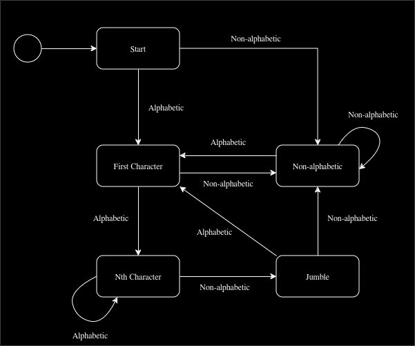

# jumbler

Thanks to the phenomena of ["Typoglycemia"][typoglycemia], the human brain is able to read text where each word has the
order of its letters shuffled, so long as the first and last letter remain in place.

Try running some plain-text through this program and reading the jumbled output.

## Building

Clone the repository and `make all`.

## Usage

To get usage hints with `jumbler`, you can use the `-h` help flag.

Here are some things to try to get you started:

```console
echo "Your text goes here. Try using some unusually lengthy and complicated words." | jumbler
cat LICENSE.txt | jumbler
jumbler -i LICENSE.txt
jumbler -i LICENSE.txt -o JUMBLEDLICENSE.txt
```

## How it Works

The `jumbler` program makes use of the following finite state machine to jumble text:

<div style="display: flex; justify-content: center;">
    
</div>

## Interesting to Know

There is [some controversy][sciencealert] surrounding the science behind this phenomena. It is also referred to as the
[transposed letter effect][typoglycemia]. Regardless, it's a fun experiment.

Due to the properties of the translation, you can run the same text through `jumbler` several times, and the effect will
be equivalent to running it through `jumbler` only once. In other words:

```console
cat LICENSE.txt | jumbler
```

and

```console
cat LICENSE.txt | jumbler | jumbler | jumbler | jumbler | jumbler | jumbler
```

are equivalent.

<!--links-->

[sciencealert]: https://www.sciencealert.com/word-jumble-meme-first-last-letters-cambridge-typoglycaemia
[typoglycemia]: https://en.wikipedia.org/wiki/Transposed_letter_effect
